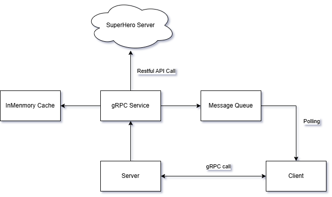

# SuperHero Service

This project provides a gRPC-based SuperHero service that allows clients to search for superheroes and receive real-time updates about changes to superhero data.

## Architecture

The following diagram illustrates the architecture of the SuperHero Service:



## Prerequisites

Before running the server and client, ensure the following prerequisites are met:

1. **Python**:
   - Install Python 3.8 or higher.
   - Install `pip` (Python package manager).

2. **Redis**:
   - Install and run a Redis server locally or use a cloud-hosted Redis instance.
   - Default Redis host: `localhost`
   - Default Redis port: `6379`

3. **Install Dependencies**:
   - Install the required Python libraries:
     ```bash
     pip install -r requirements.txt
     ```

4. **Environment Variables**:
   - Create a `.env` file in the project root directory with the following content:
     ```plaintext
     SUPERHERO_API_KEY=<your_superhero_api_key>
     ```
     Replace `<your_superhero_api_key>` with your actual API key for the SuperHero API.

## Running the Server

1. **Start the Redis Server**:
   Ensure the Redis server is running. You can start it locally with:
   ```bash
   redis-server
   ```

2. **Run the Server**:
   Start the gRPC server by running:
   ```bash
   python /Users/liminpeng/project/superhero/server/superhero_service.py
   ```

3. **Server Output**:
   The server will start on port `50051` and display logs for cache statistics and updates being produced to the message queue.

## Running the Client

1. **Run the Client**:
   Start the client by running:
   ```bash
   python /Users/liminpeng/project/superhero/client/superhero_client.py
   ```

2. **Client Output**:
   The client will:
   - Subscribe to updates from the message queue.
   - Search for a superhero (e.g., "Batman") and display the results.
   - Continuously display real-time updates for superheroes.

## Example Workflow

1. Start the Redis server.
2. Run the server in one terminal.
3. Run the client in another terminal.
4. Observe the client receiving real-time updates from the server.

## Project Structure

```
/Users/liminpeng/project/superhero
├── client/
│   ├── superhero_client.py       # Client implementation
├── components/
│   ├── message_queue.py          # Redis-backed message queue
├── server/
│   ├── api_client.py             # SuperHero API client
│   ├── cache.py                  # In-memory cache with expiration
│   ├── superhero_service.py      # gRPC server implementation
├── vendor/
│   ├── superhero_pb2.py          # gRPC protobuf definitions
│   ├── superhero_pb2_grpc.py     # gRPC service stubs
├── .env                          # Environment variables
├── requirements.txt              # Python dependencies
├── Architecture.png              # Architecture diagram
└── readme.md                     # Project documentation
```

## Notes

- Ensure the `.env` file is properly configured with your SuperHero API key.
- The Redis server must be running for the message queue to function.
- The server and client communicate via gRPC on port `50051`.
